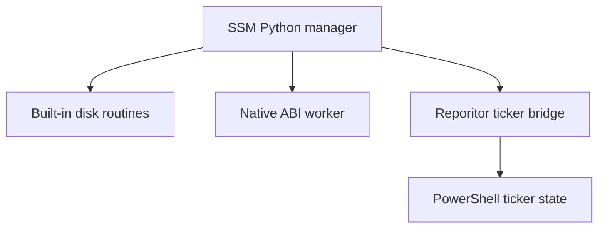

# Combined Reporit: Python Server Script Manager + Reporitor Ticker

Generated: 2026-09-27

## What was combined

This package joins two operator accords into one reviewable repository:

| Accord | Role in the combined system | Main path |
| --- | --- | --- |
| Python Server Script Manager | Python control plane for disk reports, inventory, log age reports, guarded cleanup, native C/C++/Rust connector checks, and operational forecasting. | `server-script-manager/` |
| Reporitor Ticker Standard | PowerShell repository ticker with local tickets, subvariance checks, connector health checks, tick receipts, and termination control. | `reporitor-ticker/` |

The combined copy adds a Python routine named `reporitor_ticker`. It lets the Python manager forecast and invoke the PowerShell ticker through a fixed argument list. No shell command string is evaluated.

## Combined operating model

1. The Python manager remains the top-level scheduler and forecast engine.
2. Built-in Python routines cover disk and file operations.
3. Native C, C++, or Rust routines remain behind the existing ABI v1 worker.
4. The Reporitor Ticker runs as a PowerShell connector routine when enabled.
5. The combined forecast reports missing roots, low disk headroom, job resource overlaps, native connector readiness, and ticker readiness.



## Runtime combination forecast

The combined manager now checks these conditions before a run:

| Area | Forecast check | Decision impact |
| --- | --- | --- |
| Schedule | Unknown routine names in `[[jobs]]`. | Review required when any job references an unavailable routine. |
| Resource ownership | Jobs whose declared `writes` overlap another job's `reads` or `writes`. | Review required when labels collide. |
| Disk | Existence and free space of `allowed_roots`. | Review required for missing roots or low headroom. |
| Native connector | Library path, directory confinement, ABI path readiness, platform metadata. | Review required when enabled but unavailable or blocked. |
| Reporitor ticker | PowerShell availability, ticker script path, ticker root, repository label. | Review required when enabled but not runnable. |

## How to run the combined copy

From the combined repository root:

```sh
mkdir -p server-script-manager/data/cache ticker-state
cd server-script-manager
python -m venv .venv
. .venv/bin/activate
python -m pip install -e .
ssm --config ../integration/ssm.reporitor.example.toml forecast
ssm --config ../integration/ssm.reporitor.example.toml routines
ssm --config ../integration/ssm.reporitor.example.toml run reporitor_ticker
```

On Windows PowerShell, activate the environment with:

```powershell
.\.venv\Scripts\Activate.ps1
```

Then run the same `ssm` commands.

## Configuration fields added for the ticker

Use `integration/ssm.reporitor.example.toml` as the starting point.

| Field | Purpose |
| --- | --- |
| `reporitor_ticker.enabled` | Adds `reporitor_ticker` to the routine registry and forecast. |
| `reporitor_ticker.module_path` | Directory containing `Start-ReporitorTicker.ps1`, or the start script path. |
| `reporitor_ticker.root` | Runtime state directory for ticker config, tickets, receipts, status, and stop control. |
| `reporitor_ticker.repository` | Repository label passed to the ticker, such as `owner/repository`. |
| `reporitor_ticker.interval_seconds` | Ticker interval passed to the PowerShell script. |
| `reporitor_ticker.max_ticks` | Finite run length for normal scheduled operation. |
| `reporitor_ticker.timeout_seconds` | Python subprocess timeout for one ticker invocation. |
| `reporitor_ticker.continuous` | Passes `-Continuous`; keep this false for scheduled manager jobs unless an operator wants a long-running ticker. |
| `reporitor_ticker.executable` | Optional PowerShell executable. If empty, the manager tries `pwsh` and then `powershell`. |

## Safety boundaries

- Cleanup still needs all three gates: `manager.mode = "apply"`, `policy.allow_destructive = true`, and the CLI `--apply` flag.
- The ticker bridge uses `subprocess.run([...])` with a fixed argument list.
- The ticker module keeps GitHub writes disabled by default.
- Runtime ticker state should live in `ticker-state/` or another declared operator directory.
- Native libraries remain optional and should be built for the target OS.

## Files changed in the Python manager copy

| File | Change |
| --- | --- |
| `src/server_script_manager/config.py` | Added `[reporitor_ticker]` settings. |
| `src/server_script_manager/ticker.py` | Added ticker forecast and PowerShell invocation. |
| `src/server_script_manager/manager.py` | Added routine registration, run dispatch, and forecast output. |
| `tests/test_manager.py` | Added a ticker forecast coverage check. |

## Operational recommendation

Run `ssm --config ssm.reporitor.toml forecast` before enabling interval service mode. Treat `decision = "review-required"` as an operator review queue and resolve the named advisory before long-running use.
