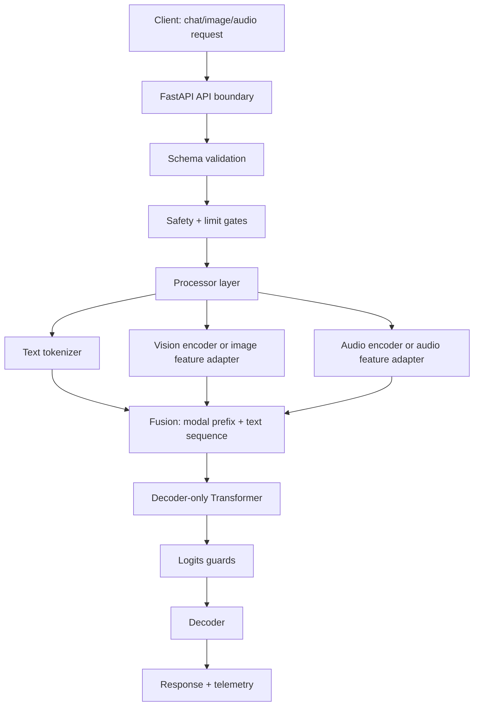
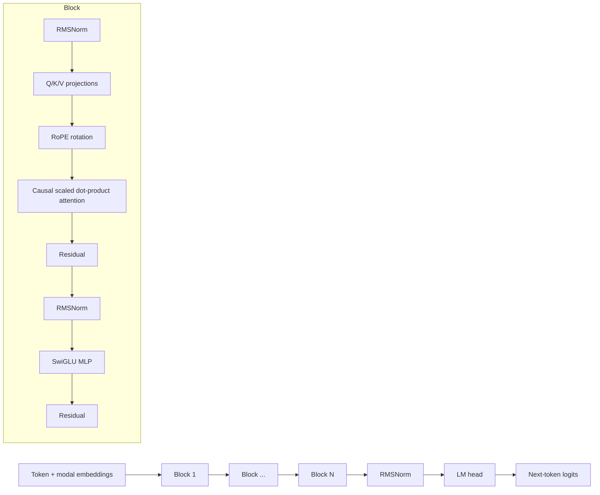
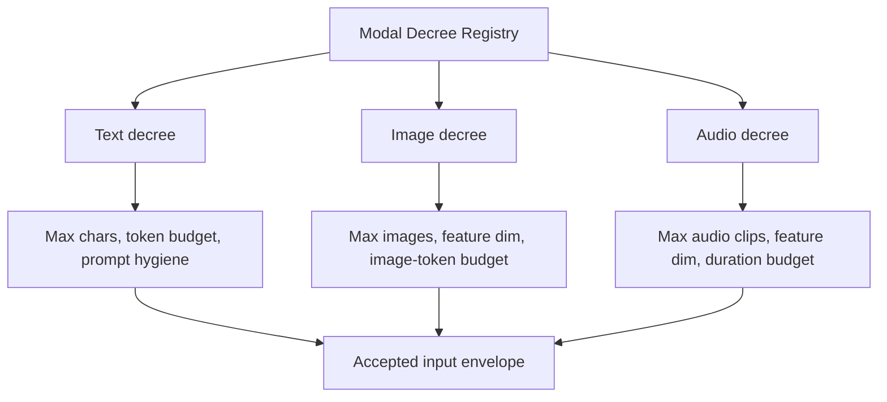

# MM-LLM Decree: production-grade multimodal LLM scaffold

This repository is a production-oriented scaffold for a **multimodal causal language model service**. It includes:

- A PyTorch transformer core with RMSNorm, RoPE, causal SDPA attention, GQA-ready heads, modality prefix fusion, and greedy generation.
- Text, image-feature, and audio-feature input paths.
- “Modal decrees”: explicit contracts for each modality, its limits, feature shape, and safety checks.
- FastAPI OpenAI-compatible-ish `/v1/chat/completions` serving.
- Docker deployment, health checks, tests, and smoke training.
- Optional adapters for Hugging Face multimodal models and vLLM serving.

> Important: this repo is a **ready-to-extend production scaffold**, not a pretrained frontier model. The included PyTorch model is intentionally small and untrained so tests and local boot are fast. For production quality outputs, load trained checkpoints or route serving through the vLLM/Hugging Face adapters.

## Architecture diagram



## Internal transformer flow



## Modal decrees



## Guarantees ledger

No LLM can guarantee truth, safety, or optimal behavior absolutely. This scaffold instead provides enforceable gates:

1. **Shape guarantee**: tensor shapes are validated by tests before model execution.
2. **Input guarantee**: Pydantic schemas and `safety.py` reject invalid/oversized requests.
3. **Modality guarantee**: `modality_decrees.py` defines allowed modality counts, dimensions, and feature budgets.
4. **Numerical guarantee**: model forward checks NaN/Inf contamination at the API boundary.
5. **Deployment guarantee**: Docker image exposes a health endpoint and can be replicated behind a load balancer.
6. **Extensibility guarantee**: custom PyTorch core and real model adapters are separated so you can swap in vLLM or Hugging Face models without rewriting the API.

## Quick start

```bash
python -m venv .venv
source .venv/bin/activate
pip install -e '.[dev]'
pytest -q
uvicorn mmllm.serve:app --host 0.0.0.0 --port 8000
```

Test request:

```bash
curl http://localhost:8000/v1/chat/completions \
  -H 'content-type: application/json' \
  -d '{
    "model":"mmllm-tiny",
    "messages":[{"role":"user","content":"Describe the modal decree system."}],
    "max_tokens":32
  }'
```

## Docker

```bash
docker build -t mmllm-decree .
docker run --rm -p 8000:8000 mmllm-decree
```

## Recommended production route

For real throughput and trained weights:

- Use this repo’s API, guardrails, tests, and modality contracts.
- Swap `InferenceEngine` with `adapters/hf_multimodal.py` for Hugging Face multimodal models.
- Use vLLM for OpenAI-compatible high-throughput serving when the target model is supported.
- Pin model revisions and package versions; do not deploy floating model references.

## Repository map

```text
src/mmllm/
  config.py              typed configuration
  tokenizer.py           byte-level smoke tokenizer
  layers.py              transformer building blocks
  model.py               multimodal causal LM
  modality_decrees.py    per-modality contracts
  safety.py              request guardrails and numerical checks
  schemas.py             OpenAI-ish API schemas
  inference.py           inference engine abstraction
  serve.py               FastAPI app
  adapters/
    hf_multimodal.py     optional Hugging Face adapter
configs/
  model.yaml             production-ish config template
docs/
  architecture.mmd       standalone Mermaid diagram
scripts/
  train_smoke.py         tiny next-token smoke trainer
tests/
  test_*.py              contracts, shape checks, API smoke
```
